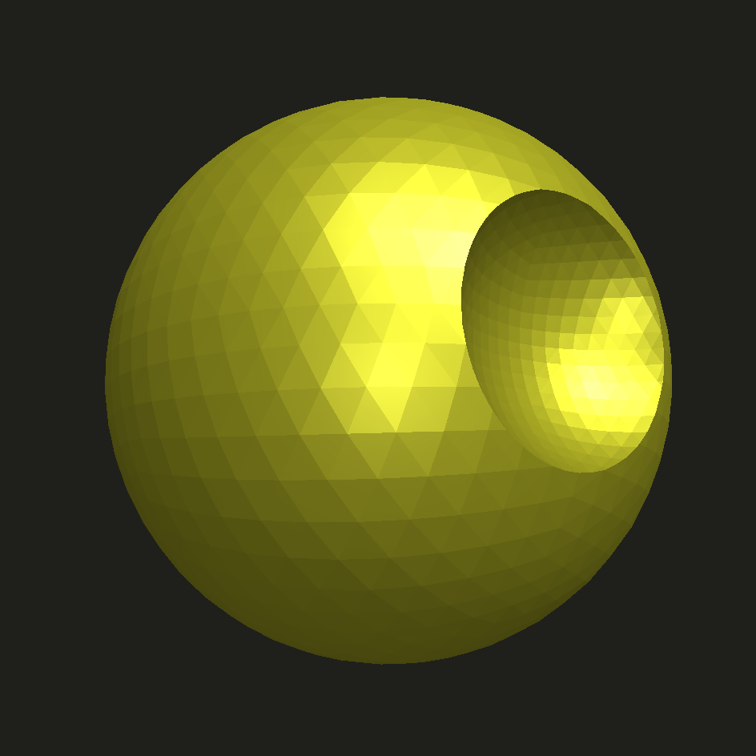
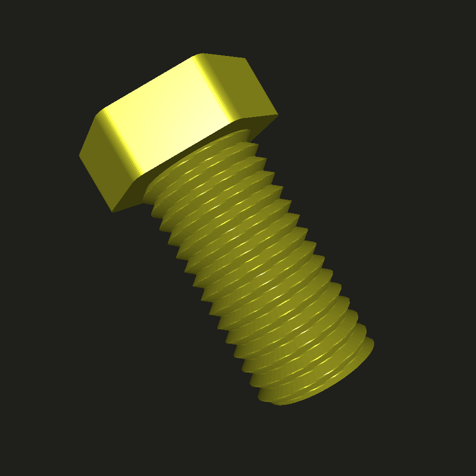

# badcad

a jupyter based cad workflow

most of the hard work is done by
- [manifold](https://github.com/elalish/manifold) - constructive solid geometry 
- [pythreejs](https://github.com/jupyter-widgets/pythreejs) - jupyter 3d previews

this project aims to focus on usability in a jupyter environment

specifically for creating and exporting functional parts

# setup

```bash
pip install git+https://github.com/elalish/manifold.git
pip install git+https://github.com/wrongbad/badcad.git
# optional dependencies (text + svg support)
pip install pycairo svgelements
```

# example

```py
from badcad import *
plus = square(3, 1, center=True) + square(1, 3, center=True)
p_lil = plus.offset(-0.4, 'round')
p_big = plus.offset(+0.4, 'round')
p_big.extrude_to(p_lil, 1)
```


```py
from badcad import *
deathstar = sphere(r=1) - sphere(r=0.5).move(1.2,0,0)
deathstar.to_stl('deathstar.stl')
deathstar
```



```py
from badcad import *
bolt = threads(d=8, h=16, pitch=1) 
bolt + circle(r=5, fn=6).offset(1,'round').extrude(4).move(0,0,15)
```



```py
from badcad import *
t = text('yo', font='monospace')
t.offset(1,'round').extrude(2) - t.extrude(2)
```


# interesting functions

`Shape.extrude_to()` - automatically find min-distance alignment between two polygons and create 3d extrusion from one to the other

`threads()` - generate screw threads

`Shape.align()`, `Solid.align()` - use bounding box to align center, min, or max to given location, per axis

# motivation

to escape openscad syntax - op wrapping and nesting is an editing nightmare compared to `A + B.move(...) - C` style

to escape openscad render times - manifold lib is 1000x faster for high-poly boolean ops

to enable easier prototyping of mesh algorithms in the CAD environment
