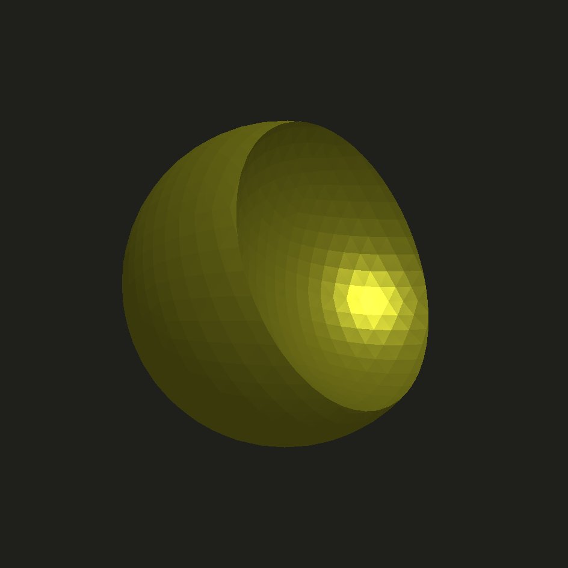

# badcad

a jupyter based cad workflow

most of the hard work is done by
- [manifold](https://github.com/elalish/manifold) - constructive solid geometry 
- [pythreejs](https://github.com/jupyter-widgets/pythreejs) - jupyter 3d previews

this project aims to focus on usability in a jupyter environment

# setup

```bash
# temporary fix for polygon revolve
pip install git+https://github.com/wrongbad/manifold.git

pip install git+https://github.com/wrongbad/badcad.git
```

# example

```py
from badcad import *
sphere(r=1) - sphere(r=1).move(1,0,0)
```



```py
deathstar = sphere(r=1) - sphere(r=0.5).move(1.2,0,0)

with open('deathstar.stl', 'wb') as f:
    f.write(deathstar.stl())
```

# vscode

to remove ugly white padding in vs-code jupyter, add a cell like this 
```html
%%html
<style> .cell-output-ipywidget-background { background-color: transparent !important; } </style>
```