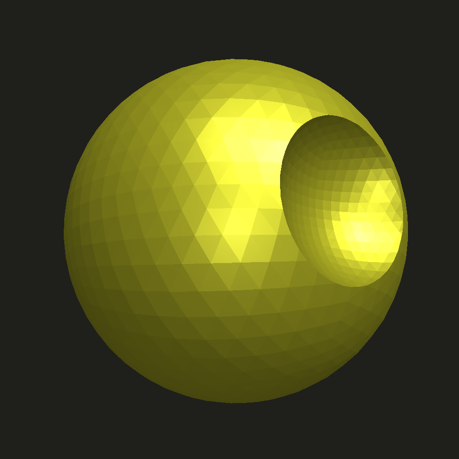

# badcad

a jupyter based cad workflow

most of the hard work is done by
- [manifold](https://github.com/elalish/manifold) - constructive solid geometry 
- [pythreejs](https://github.com/jupyter-widgets/pythreejs) - jupyter 3d previews

this project aims to focus on usability in a jupyter environment

# setup

```bash
# temporary until changes make it upstream
pip install git+https://github.com/wrongbad/manifold.git@develop

pip install git+https://github.com/wrongbad/badcad.git
```

# example

```py
from badcad import *
plus = square(3, 1, center=True) + square(1, 3, center=True)
p_lil = plus.offset(-0.4, 'round')
p_big = plus.offset(+0.4, 'round')
p_big.extrude_to(p_lil, 1)
```


```py
from badcad import *
deathstar = sphere(r=1) - sphere(r=1).move(1,0,0)
deathstar.to_stl('deathstar.stl')
deathstar
```



# vscode

to remove ugly white padding in vs-code jupyter, add a cell like this 
```html
%%html
<style> .cell-output-ipywidget-background { background-color: transparent !important; } </style>
```